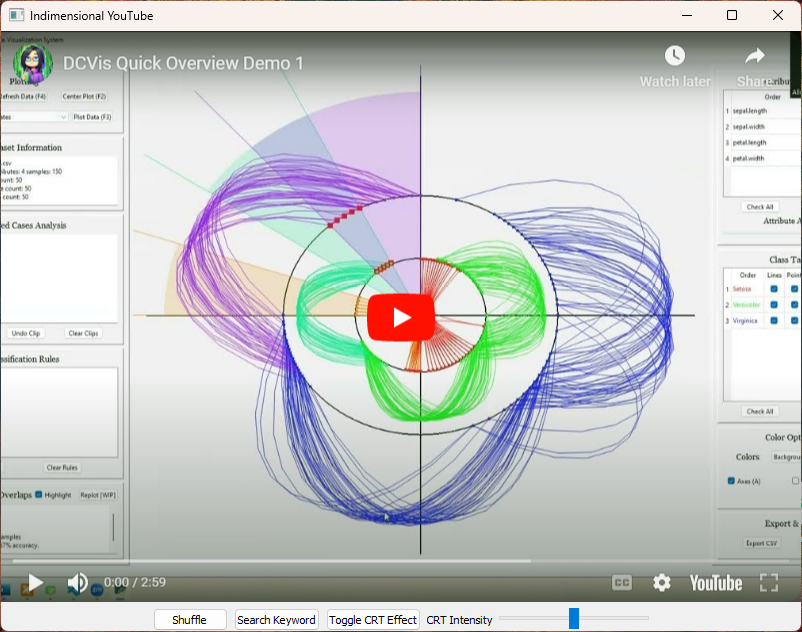

# Indimensional Youtube
 
Indimensional Youtube dynamically shuffles and plays random YouTube videos based on either a user-defined or randomly selected search term from a dictionary file. Has controls for shuffling videos, applying a CRT effect with adjustable intensity, and filtering searches by custom keywords.

## About the App

Dictionary file from: https://svnweb.freebsd.org/csrg/share/dict/words?view=co&content-type=text/plain

Youtube connection with pytube.

UI with PyQt5.

All videos are hosted on the YouTube platform.

## Pip Packages

PyQt5 PyQtWebEngine pytube

## Future Work

- Autoplay
- Video length search
- Topical search versus just single phrase search for a group of phrases
- Dark mode, UI, CRT skin

## License

This project is available for free under the MIT License.
